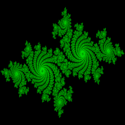

## TornadoVM examples for QCon Plus 2021

Code and examples used for the QCon Plus 2021 presentation: https://plus.qconferences.com/plus2021/track/modern-jvm-innovations 


## 1. Build TornadoVM

Run run the examples, first build TornadoVM with both backends (OpenCL and PTX).


**Important:** If you do not have an NVIDIA GPU and CUDA installed, do not use the flag `--ptx` in the following command. 


```bash
git clone https://github.com/beehive-lab/tornadovm-installer.git 
cd tornadovm-installer
./tornadovmInstaller.sh --jdk8 --opencl --ptx 
source TornadoVM-OpenJDK8/TornadoVM/source.sh
```

Check installation:

```bash
tornado --devices

Number of Tornado drivers: 2
Total number of PTX devices  : 1
Tornado device=0:0
	PTX -- NVIDIA GeForce RTX 2060 with Max-Q Design
		Global Memory Size: 5.8 GB
		Local Memory Size: 48.0 KB
		Workgroup Dimensions: 3
		Max WorkGroup Configuration: [1024, 1024, 64]
		Device OpenCL C version: N/A

Total number of OpenCL devices  : 3
Tornado device=1:0
	NVIDIA CUDA -- NVIDIA GeForce RTX 2060 with Max-Q Design
		Global Memory Size: 5.8 GB
		Local Memory Size: 48.0 KB
		Workgroup Dimensions: 3
		Max WorkGroup Configuration: [1024, 1024, 64]
		Device OpenCL C version: OpenCL C 1.2

Tornado device=1:1
	Intel(R) OpenCL HD Graphics -- Intel(R) UHD Graphics [0x9bc4]
		Global Memory Size: 24.9 GB
		Local Memory Size: 64.0 KB
		Workgroup Dimensions: 3
		Max WorkGroup Configuration: [256, 256, 256]
		Device OpenCL C version: OpenCL C 3.0

Tornado device=1:2
	Intel(R) CPU Runtime for OpenCL(TM) Applications -- Intel(R) Core(TM) i9-10885H CPU @ 2.40GHz
		Global Memory Size: 31.1 GB
		Local Memory Size: 32.0 KB
		Workgroup Dimensions: 3
		Max WorkGroup Configuration: [8192, 8192, 8192]
		Device OpenCL C version: OpenCL C 2.0
```


Note that, depending on the devices you have and the drivers installed (e.g., NVIDIA CUDA, OpenCL, etc), you will see different implementations. 


## 2. Setup the examples


```bash
git clone https://github.com/jjfumero/qconplus2021-tornadovm.git
cd qconplus2021-tornadovm.git
source /path-to-your-Tornado-DIR/tornadovm-installer/TornadoVM/source.sh
export TORNADO_SDK=/path-to-your-Tornado-DIR/tornadovm-installer/TornadoVM-OpenJDK8/TornadoVM/bin/sdk
mvn clean package
```


## Run Examples


#### A: Julia Sets
```bash
## Run Julia Sets with TornadoVM accelerated on GPUs
## The following example will generate and image in the tmp directory of your OS
## File: juliaSets.png
tornado -cp target/qconplus2021-1.0-SNAPSHOT.jar qconplus2021.samples.JuliaSets --tornado
```

Example image:




#### B: DFT
```bash
## Run DFT 
## This program has three arguments:
##   <size> 
##   <mode: parallel | sequential > 
##   <iterations> 
tornado -cp target/qconplus2021-1.0-SNAPSHOT.jar qconplus2021.samples.DFT 8192 parallel 100


## Selecting another backend (if installed with TornadoVM)
tornado -Ds0.t0.device=1:0 -cp target/qconplus2021-1.0-SNAPSHOT.jar qconplus2021.samples.DFT 8192 parallel 100


## Print Generated Kernel
tornado --printKernel -cp target/qconplus2021-1.0-SNAPSHOT.jar qconplus2021.samples.DFT 8192 parallel 100


## Display in which accelerator the applications was launched and the block of threads used
tornado --threadInfo -cp target/qconplus2021-1.0-SNAPSHOT.jar qconplus2021.samples.DFT 8192 parallel 100
```

